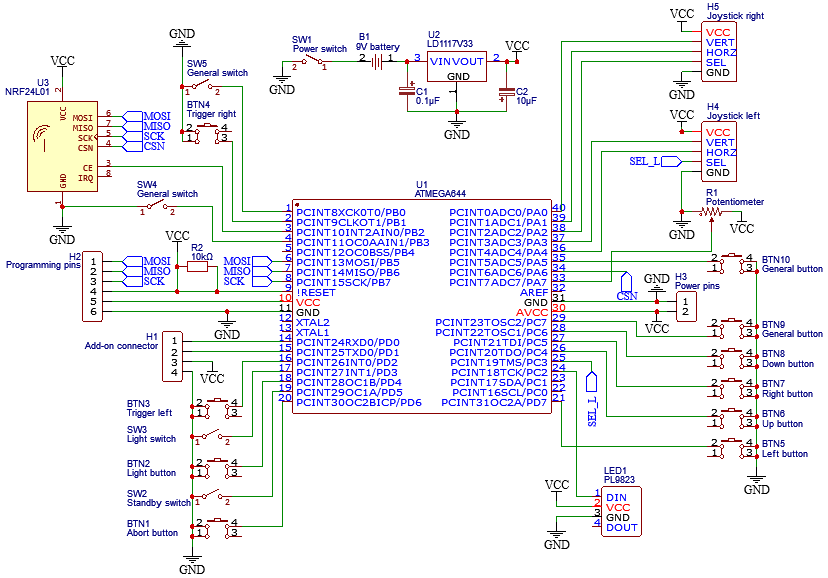

# Multi Purpose Controller

This is a wireless controller that can be used with multiple devices and projects.  
It uses an ATmega644 to control the circuit and an nRF24LO1 for communication.  

## Features

Controller inputs
- 6 general purpose buttons
- 2 general purpose switches
- 2 joysticks (with built in buttons)
- 2 trigger buttons
- A potentiometer
- An abort/shutdown button
- Standby mode switch
- A light button and switch

UART connector for addons

An RGB LED (PL9823) giving the status of the controller

## Usage

1. Turn the power switch on and wait for the green light
2. Turn on the device that is being used
3. Press some buttons!

LED colour | Meaning
---------- | ------------------------
Red        | Initialising or aborted
Orange     | Waiting for other device
Blue       | Standby mode
Green      | Sending data

## Installation and Setup

### Making the controller

Solder the circuit according to the circuit diagram

An example of a completed circuit (missing triggers) that is compatible with the prints  

3D print the base of the controller

Attach the electronics to the print with screws

### Uploading the code

Install the [RF24](https://github.com/nRF24/RF24) and [FastLED](https://github.com/FastLED/FastLED) libraries and [MightyCode](https://github.com/MCUdude/MightyCore) on the arduino IDE

Make sure the standard pinout and internal clock is selected in the settings then upload the code to the ATmega644